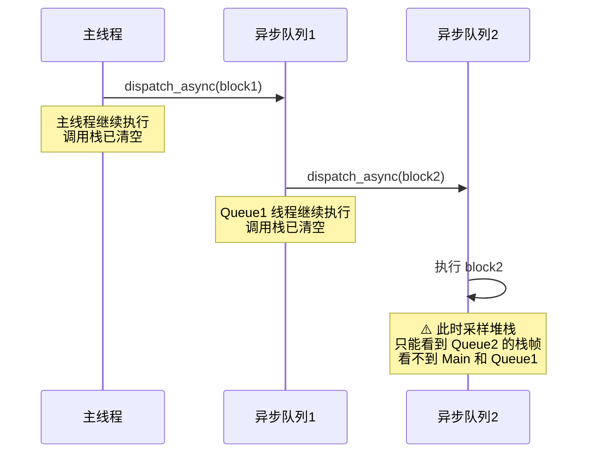
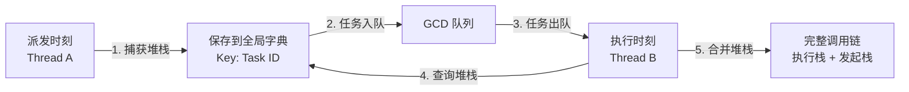
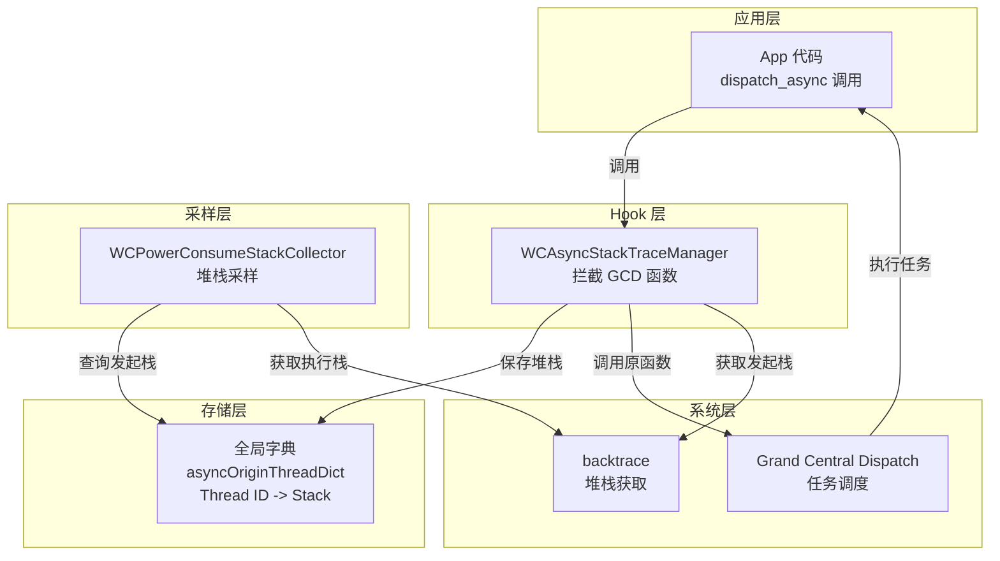
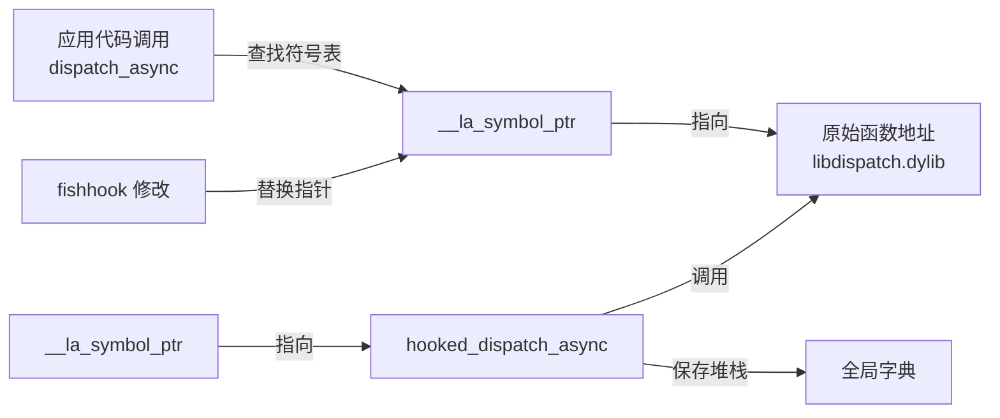
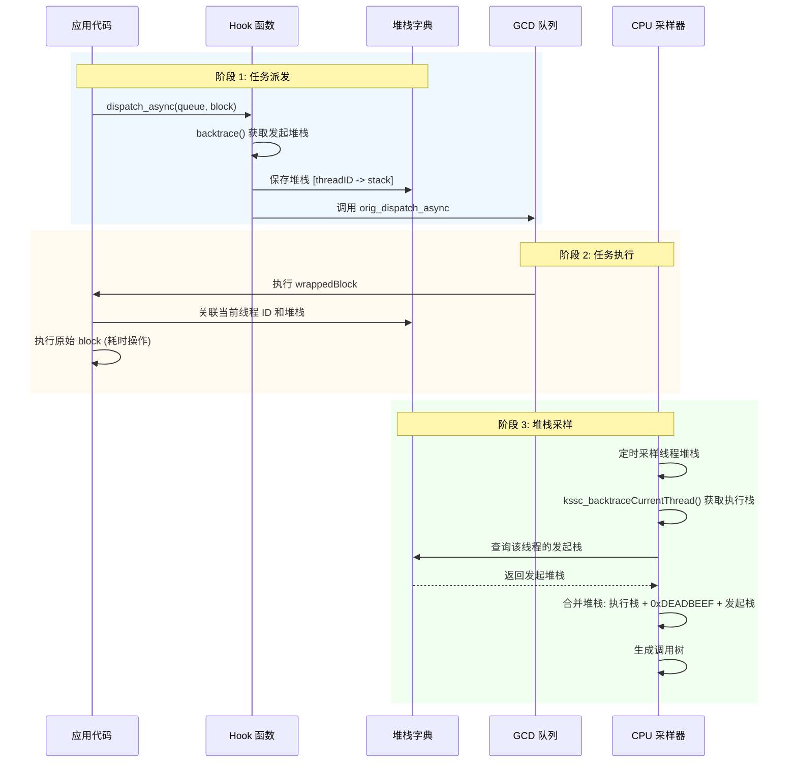

# Matrix 异步堆栈追溯技术实现

## 📋 目录

- [1. 技术背景](#1-技术背景)
- [2. 核心问题](#2-核心问题)
- [3. 实现思路](#3-实现思路)
- [4. 技术架构](#4-技术架构)
- [5. 关键技术点](#5-关键技术点)
- [6. 实现步骤](#6-实现步骤)
- [7. 数据流程](#7-数据流程)
- [8. 测试验证](#8-测试验证)

---

## 1. 技术背景

### 1.1 问题描述

在 iOS 应用中，CPU 耗电监控是性能优化的重要环节。Matrix 通过采样线程堆栈来分析 CPU 消耗，但在异步场景下存在一个关键问题：

**现象：** 当使用 `dispatch_async` 等 GCD 异步函数派发任务时，CPU 监控只能捕获到异步任务执行时的堆栈，而无法追溯到**是谁发起的这个异步任务**。

**示例场景：**
```objc
// ViewController.m
- (void)testMultiLayerAsync {
    dispatch_async(queue1, ^{
        dispatch_async(queue2, ^{
            // 🔥 这里执行耗时操作
            [self heavyComputation];
        });
    });
}
```

**传统堆栈采样结果：**
```
Thread 5:
0. heavyComputation
1. __dispatch_call_block_and_release
2. _dispatch_worker_thread
```

**问题：** 看不到 `testMultiLayerAsync` 方法，无法定位问题源头。

### 1.2 解决目标

实现**异步堆栈追溯（Async Stack Trace）**，在堆栈中显示异步任务的发起者：

```
Thread 5:
0. heavyComputation
1. __dispatch_call_block_and_release
--- 0xDEADBEEF (异步边界) ---
2. testMultiLayerAsync                    ⬅️ 能看到发起者！
3. buttonTapped
```

---

## 2. 核心问题

### 2.1 为什么会丢失调用链？



**根本原因：**
- 异步任务在**不同线程**上执行
- 原始调用线程的栈帧已经**返回并销毁**
- `backtrace()` 只能获取**当前线程**的调用栈

### 2.2 技术挑战

| 挑战 | 描述 |
|------|------|
| **时间差** | 发起时刻和执行时刻不同 |
| **线程切换** | 发起线程和执行线程不同 |
| **栈帧销毁** | 发起时的栈帧已经返回 |
| **多层嵌套** | 异步任务可能多层嵌套派发 |
| **性能开销** | 需要为每个异步任务保存堆栈 |

---

## 3. 实现思路

### 3.1 核心思想

**在异步任务派发时，捕获发起者的堆栈，并在任务执行时关联起来。**



### 3.2 技术方案

采用 **Hook + 堆栈存储 + 合并** 的三阶段方案：

#### 阶段 1: Hook GCD 派发函数
使用 `fishhook` 拦截所有异步派发函数：
- `dispatch_async`
- `dispatch_after`
- `dispatch_barrier_async`
- `dispatch_async_f` / `dispatch_after_f` / `dispatch_barrier_async_f`

#### 阶段 2: 捕获并存储发起堆栈
在 hook 函数中：
1. 调用 `backtrace()` 获取当前（发起）线程的堆栈
2. 将堆栈存储到全局字典，Key 为执行线程 ID
3. 调用原始派发函数

#### 阶段 3: 执行时合并堆栈
在 CPU 采样时：
1. 获取当前（执行）线程的堆栈
2. 从全局字典查询该线程的发起堆栈
3. 用 `0xDEADBEEF` 作为分界标记，合并两段堆栈

---

## 4. 技术架构

### 4.1 模块结构



### 4.2 核心类设计

```
WCAsyncStackTraceManager (异步堆栈管理器)
├── enableAsyncStackTrace       // 启用功能，执行 hook
├── getOriginStackForThread     // 查询线程的发起堆栈
├── cleanupExpiredStacks        // 清理过期堆栈记录
└── isEnabled                   // 是否已启用

全局数据结构：
├── g_asyncOriginThreadDict     // 堆栈存储字典
├── g_asyncStackMutex           // 线程安全锁
├── orig_dispatch_async         // 原始函数指针
└── hooked_dispatch_async       // Hook 后的函数
```

---

## 5. 关键技术点

### 5.1 fishhook 原理

fishhook 通过修改 Mach-O 可执行文件的**符号表**来实现 C 函数 hook：



**关键步骤：**
1. 遍历 Mach-O 的 `__DATA` 段
2. 找到 `__la_symbol_ptr`（延迟绑定符号表）
3. 修改符号指针，指向 hook 函数
4. 保存原始函数指针，用于后续调用

**技术难点：**
- `__DATA_CONST` 段是**只读内存**，需要临时修改内存保护权限
- `mprotect()` 要求地址**页对齐**（4KB/16KB 边界）

### 5.2 堆栈捕获 ⭐

#### 5.2.1 技术选型：backtrace() vs kssc_backtraceCurrentThread()

Matrix 中存在两种堆栈获取方式，在不同场景下使用：

| 函数 | 适用场景 | 原理 | 性能 |
|------|----------|------|------|
| **`backtrace()`** | 获取**当前线程**堆栈 | 遍历自己的栈帧 | ~0.1ms |
| **`kssc_backtraceCurrentThread()`** | 获取**其他线程**堆栈 | `thread_get_state()` + 挂起线程 | ~1-2ms |

**在 WCAsyncStackTraceManager 中使用 backtrace() 的原因：**

```objc
// ✅ 正确的选择：使用 backtrace()
void hooked_dispatch_async(dispatch_queue_t queue, dispatch_block_t block) {
    // 🔹 此时在发起线程上执行（如主线程）
    // 🔹 需要获取的是**自己**的堆栈，不是其他线程的堆栈
    uintptr_t stackBuffer[50];
    int count = backtrace(buffer, 50);  // ✅ 快速、简单、无需挂起
    
    // 保存堆栈供异步线程使用
    NSArray *originStack = stackToArray(stackBuffer, count);
    
    dispatch_block_t wrappedBlock = ^{
        // 这里才切换到异步线程
        saveAsyncStack(getCurrentThreadID(), originStack);
        block();
    };
    
    orig_dispatch_async(queue, wrappedBlock);
}
```

**对比：CPU 采样器中必须使用 kssc_backtraceCurrentThread()：**

```objc
// WCPowerConsumeStackCollector.mm
// ⚠️ 必须使用 kssc_backtraceCurrentThread()
for (size_t i = 0; i < threadCount; i++) {
    thread_t targetThread = thread_list[i];
    
    // 🔹 需要获取**其他线程**的堆栈（不是自己的）
    // 🔹 必须先挂起目标线程
    thread_suspend(targetThread);  // ⚠️ 必须
    kssc_backtraceCurrentThread(targetThread, buffer, maxEntries);
    thread_resume(targetThread);
}
```

#### 5.2.2 backtrace() 工作原理

```c
// getCurrentThreadStack 实现
uintptr_t stackBuffer[50];
void **buffer = (void **)malloc(50 * sizeof(void *));
int count = backtrace(buffer, 50);  // POSIX 标准函数

for (int i = 0; i < count; i++) {
    stackBuffer[i] = (uintptr_t)buffer[i];
}
free(buffer);
```

**原理：遍历 Frame Pointer (FP) 链**

```
当前线程栈结构（ARM64）:
┌────────────────────┐
│ LR (返回地址)      │ ← FP + 8
├────────────────────┤
│ Previous FP        │ ← FP + 0
├────────────────────┤
│ 局部变量           │
└────────────────────┘
       ↓ (沿着 FP 链向上遍历)
┌────────────────────┐
│ LR (返回地址)      │
├────────────────────┤
│ Previous FP        │
└────────────────────┘
```

**返回的地址含义：**
- 函数返回地址（Return Address）
- **虚拟内存地址**（Virtual Memory Address = ASLR 基址 + 偏移）
- 可通过符号化（symbolicating）转换为函数名 + 偏移

**虚拟内存地址示例：**
```c
// backtrace() 返回的地址
uintptr_t addresses[] = {
    0x0000000102abc100,  // ← 虚拟内存地址（运行时动态地址）
    0x0000000102abd200,  //   = ASLR 基址 + 函数在 Mach-O 中的偏移
    0x00000001febcd300,
};
```

#### 5.2.3 地址符号化 ⭐

**虚拟内存地址可以通过符号表解析！** Matrix 支持两种符号化方式：

##### 方式一：运行时符号化（`dladdr`）

**优点：** 快速、实时、无需外部文件

```c
#include <dlfcn.h>

uintptr_t address = 0x102abc100;  // backtrace 返回的地址

Dl_info info;
if (dladdr((void *)address, &info)) {
    printf("库路径:   %s\n", info.dli_fname);    // /path/to/MatrixTestApp
    printf("库基址:   %p\n", info.dli_fbase);    // 0x102000000
    printf("符号名称: %s\n", info.dli_sname);    // -[ViewController testScenario2]
    printf("符号地址: %p\n", info.dli_saddr);    // 0x102abc100
}
```

**Matrix 实现：** `KSSymbolicator.c`

```c
bool kssymbolicator_symbolicate(KSStackCursor *cursor) {
    Dl_info symbolsBuffer;
    if (ksdl_dladdr_use_cache(cursor->stackEntry.address, &symbolsBuffer)) {
        cursor->stackEntry.imageName = symbolsBuffer.dli_fname;     // 库路径
        cursor->stackEntry.symbolName = symbolsBuffer.dli_sname;    // ✅ 函数名
        return true;
    }
    return false;
}
```

**局限性：**
- ❌ 无法获取源文件路径和行号
- ❌ Release 构建如果 strip 了符号会失败
- ❌ C++ 符号是 mangled 名称（`_ZN6MyTest15heavyComputationEv`）

##### 方式二：离线符号化（`atos` + dSYM）

**优点：** 完整信息（函数名 + 文件 + 行号）

```bash
# 使用 atos 工具符号化地址
atos -arch arm64 \
     -o MatrixTestApp.app.dSYM/Contents/Resources/DWARF/MatrixTestApp \
     -l 0x102000000 \  # 加载地址（ASLR 基址）
     0x102abc100       # 虚拟内存地址

# 输出：
-[TestAsyncCPUViewController testScenario2] (in MatrixTestApp) (TestAsyncCPUViewController.mm:45)
```

**关键公式：**
```
虚拟内存地址 = 加载地址 + 偏移

0x102abc100 = 0x102000000 + 0x00abc100
    ↑            ↑              ↑
 运行时地址   ASLR 基址     固定偏移（Mach-O）
```

**Matrix 离线符号化工具：**
- Python: `symbolicate_matrix_report.py`
- Go: `matrix-symbolicate-server/symbolicate.go`

```python
# 符号化整个报告
python symbolicate_matrix_report.py \
    --report cpu_report.json \
    --dsym MatrixTestApp.app.dSYM \
    --output symbolicated_report.json
```

**符号化对比：**

| 方式 | 技术 | 速度 | 信息完整度 | 适用场景 |
|------|------|------|-----------|----------|
| **运行时** | `dladdr()` | ~0.05ms | ⭐⭐⭐<br/>函数名 | 实时监控 |
| **离线** | `atos` + dSYM | ~100ms | ⭐⭐⭐⭐⭐<br/>函数名 + 文件 + 行号 | 报告分析 |

#### 5.2.4 性能对比

**高频 dispatch_async 场景（1000 次/秒）：**

```
backtrace():                 100ms   (0.1ms × 1000)   ✅
kssc_backtraceCurrentThread: 1000ms  (1ms × 1000)     ❌ 10倍开销
```

**结论：** 在 hook 函数中使用 `backtrace()` 是性能和正确性的最佳平衡。

### 5.3 线程 ID 关联

```objc
// 发起时刻（主线程）
thread_t originThread = pthread_mach_thread_np(pthread_self());
[dict setObject:stack forKey:@(originThread)];

// 执行时刻（异步线程）
thread_t currentThread = pthread_mach_thread_np(pthread_self());
NSArray *originStack = [dict objectForKey:@(currentThread)];
```

**为什么用执行线程 ID 作为 Key？**
- 派发时无法预知在哪个线程执行
- 执行时可以用当前线程 ID 反查
- 简单高效，无需生成额外的 Task ID

### 5.4 堆栈合并策略

```
+---------------------------+
| 执行线程堆栈 (当前)        |
| [0] heavyComputation      |
| [1] block_invoke          |
| [2] _dispatch_call_block  |
+---------------------------+
| 0xDEADBEEF (异步分界线)   | ⬅️ 魔数标记
+---------------------------+
| 发起线程堆栈 (历史)        |
| [3] testMultiLayerAsync   |
| [4] dispatch_async        |
| [5] buttonTapped          |
+---------------------------+
```

**实现代码：**
```objc
// 1. 获取执行堆栈
int execLength = kssc_backtraceCurrentThread(thread, buffer, maxEntries);

// 2. 查询发起堆栈
NSArray *originStack = [asyncManager getOriginStackForThread:thread];

// 3. 添加分界标记
if (originStack && originStack.count > 0) {
    buffer[execLength++] = 0xDEADBEEF;  // 异步边界
    
    // 4. 追加发起堆栈
    for (NSNumber *addr in originStack) {
        buffer[execLength++] = [addr unsignedLongValue];
    }
}
```

### 5.5 内存管理

**问题：** 异步任务可能永远不执行，导致堆栈记录泄漏。

**解决方案：** 定期清理过期线程的堆栈记录

```objc
- (void)cleanupExpiredStacks {
    for (NSNumber *threadID in g_asyncOriginThreadDict) {
        thread_t thread = (thread_t)[threadID unsignedIntValue];
        
        // 检查线程是否还存在
        kern_return_t kr = thread_info(thread, THREAD_BASIC_INFO, ...);
        
        if (kr != KERN_SUCCESS) {
            // 线程已销毁，移除记录
            [g_asyncOriginThreadDict removeObjectForKey:threadID];
        }
    }
}
```

---

## 6. 实现步骤

### 步骤 1: 创建异步堆栈管理器

**文件：** `WCAsyncStackTraceManager.h`

```objc
@interface WCAsyncStackTraceManager : NSObject

+ (instancetype)sharedInstance;

// 启用异步堆栈追溯（hook GCD 函数）
- (BOOL)enableAsyncStackTrace;

// 获取指定线程的发起堆栈
- (nullable NSArray<NSNumber *> *)getOriginStackForThread:(thread_t)thread;

// 清理过期堆栈记录
- (void)cleanupExpiredStacks;

// 是否已启用
- (BOOL)isEnabled;

@end
```

### 步骤 2: 实现 Hook 逻辑

**文件：** `WCAsyncStackTraceManager.mm`

#### 2.1 定义全局变量

```objc
// 堆栈存储字典
static NSMutableDictionary<NSNumber *, NSArray<NSNumber *> *> *g_asyncOriginThreadDict;

// 线程安全锁
static pthread_mutex_t g_asyncStackMutex = PTHREAD_MUTEX_INITIALIZER;

// 原始函数指针
static void (*orig_dispatch_async)(dispatch_queue_t, dispatch_block_t);
static void (*orig_dispatch_after)(dispatch_time_t, dispatch_queue_t, dispatch_block_t);
```

#### 2.2 实现 Hook 函数

```objc
void hooked_dispatch_async(dispatch_queue_t queue, dispatch_block_t block) {
    // 1. 获取发起线程堆栈
    uintptr_t stackBuffer[50];
    int stackCount = getCurrentThreadStack(stackBuffer, 50);
    NSArray *originStack = stackToArray(stackBuffer, stackCount);
    
    // 2. 包装 block
    dispatch_block_t wrappedBlock = ^{
        // 3. 执行时关联堆栈
        thread_t currentThread = getCurrentThreadID();
        saveAsyncStack(currentThread, originStack);
        
        // 4. 执行原始 block
        block();
    };
    
    // 5. 调用原始函数
    orig_dispatch_async(queue, wrappedBlock);
}
```

#### 2.3 执行 Hook

```objc
- (BOOL)enableAsyncStackTrace {
    struct rebinding rebindings[] = {
        {"dispatch_async", hooked_dispatch_async, &orig_dispatch_async},
        {"dispatch_after", hooked_dispatch_after, &orig_dispatch_after},
        {"dispatch_barrier_async", hooked_dispatch_barrier_async, &orig_dispatch_barrier_async},
    };
    
    int result = rebind_symbols(rebindings, 3);
    return (result == 0);
}
```

### 步骤 3: 修复 fishhook 内存保护问题

**问题：** `__DATA_CONST` 段是只读的，直接写入会崩溃。

**解决方案：** 临时修改内存保护权限

```c
// fishhook.c
void **indirect_symbol_bindings = (void **)((uintptr_t)slide + section->addr);

if (isDataConst) {
    // 1. 计算页对齐地址
    uintptr_t start = (uintptr_t)indirect_symbol_bindings;
    uintptr_t pageStart = start & ~(getpagesize() - 1);  // 向下对齐
    uintptr_t end = start + section->size;
    size_t protectSize = end - pageStart;
    
    // 2. 修改为可写
    mprotect((void *)pageStart, protectSize, PROT_READ | PROT_WRITE);
}

// 3. 修改符号指针
indirect_symbol_bindings[i] = replacement;

if (isDataConst) {
    // 4. 恢复原始保护权限
    mprotect((void *)pageStart, protectSize, oldProtection);
}
```

**关键点：**
- `getpagesize()` 获取系统页大小（通常 4096 字节）
- 地址必须对齐到页边界
- 需要引入 `<unistd.h>` 头文件

### 步骤 4: 集成到 CPU 采样器

**文件：** `WCPowerConsumeStackCollector.mm`

```objc
#import "WCAsyncStackTraceManager.h"

// 在 getStackInfoWithThreadCount 方法中
- (size_t)getStackInfoWithThreadCount:(size_t)threadCount {
    // ... 原有代码：获取线程列表
    
    for (size_t i = 0; i < threadCount; i++) {
        thread_t current_thread = thread_list[i];
        
        // 1. 获取执行线程堆栈
        uintptr_t backtrace_buffer[maxEntries];
        int currentLength = kssc_backtraceCurrentThread(current_thread, 
                                                        backtrace_buffer, 
                                                        maxEntries);
        
        // 🆕 2. 合并异步堆栈
        WCAsyncStackTraceManager *asyncManager = [WCAsyncStackTraceManager sharedInstance];
        if ([asyncManager isEnabled]) {
            NSArray<NSNumber *> *originStack = [asyncManager getOriginStackForThread:current_thread];
            
            if (originStack && originStack.count > 0) {
                // 添加异步分界线
                if (currentLength < maxEntries) {
                    backtrace_buffer[currentLength++] = 0xDEADBEEF;
                }
                
                // 追加发起堆栈
                for (NSNumber *addr in originStack) {
                    if (currentLength < maxEntries) {
                        backtrace_buffer[currentLength++] = [addr unsignedLongValue];
                    }
                }
            }
        }
        
        trace_length_matrix[i] = currentLength;
    }
}
```

### 步骤 5: 导出公共接口

**文件：** `Matrix.h`

```objc
#import "WCAsyncStackTraceManager.h"  // 添加到 Matrix 主头文件
```

**Xcode 配置：** 将 `WCAsyncStackTraceManager.h` 标记为 **Public Header**

```
project.pbxproj:
8928C2CF49C24716A8EE528B /* WCAsyncStackTraceManager.h in Headers */ = {
    isa = PBXBuildFile; 
    fileRef = 2573324B29AF4E21B5FF17E9 /* WCAsyncStackTraceManager.h */; 
    settings = {ATTRIBUTES = (Public, ); };  // ⬅️ 标记为 Public
};
```

### 步骤 6: 应用启动时启用功能

**文件：** `AppDelegate.m`

```objc
#import <Matrix/WCAsyncStackTraceManager.h>

- (BOOL)application:(UIApplication *)application 
    didFinishLaunchingWithOptions:(NSDictionary *)launchOptions {
    
    // ⚠️ 必须在 Matrix 初始化之前启用
    [[WCAsyncStackTraceManager sharedInstance] enableAsyncStackTrace];
    
    // 初始化 Matrix
    [[MatrixHandler sharedInstance] installMatrix];
    
    return YES;
}
```

---

## 7. 数据流程

### 7.1 完整流程图



### 7.2 内存数据结构

```
g_asyncOriginThreadDict (全局字典)
├── Key: 0x1234 (Thread ID)
│   └── Value: [@0x10002a000, @0x10002b100, @0x10002c200, ...]
│
├── Key: 0x5678 (Thread ID)
│   └── Value: [@0x10003a000, @0x10003b100, ...]
│
└── Key: 0x9abc (Thread ID)
    └── Value: [@0x10004a000, @0x10004b100, ...]

每个堆栈地址可通过 dSYM 符号化:
0x10002a000 -> -[ViewController testMultiLayerAsync] + 20
0x10002b100 -> -[ViewController buttonTapped:] + 56
```

---

## 8. 测试验证

### 8.1 测试场景

#### 场景 1: 单层异步任务
```objc
- (void)testScenario1 {
    dispatch_async(dispatch_get_global_queue(DISPATCH_QUEUE_PRIORITY_DEFAULT, 0), ^{
        [self performHeavyImageProcessingWithDuration:5.0 taskName:@"场景1-单层异步"];
    });
}
```

**预期结果：** ✅ 能看到 `testScenario1` 方法名（通过 block 符号）

#### 场景 2: 多层嵌套异步任务 ⭐
```objc
- (void)testScenario2 {
    dispatch_queue_t queue1 = dispatch_queue_create("queue1", DISPATCH_QUEUE_SERIAL);
    dispatch_async(queue1, ^{
        NSLog(@"第一层异步开始");
        
        dispatch_queue_t queue2 = dispatch_queue_create("queue2", DISPATCH_QUEUE_SERIAL);
        dispatch_async(queue2, ^{
            NSLog(@"第二层异步开始");
            [self performHeavyImageProcessingWithDuration:5.0 taskName:@"场景2-多层嵌套"];
        });
    });
}
```

**预期结果：** ✅ **通过异步堆栈追溯能看到 `testScenario2`**

**传统 Matrix（无异步追溯）：**
```
Thread 5:
0. vImageConvolve_ARGB8888
1. -[TestAsyncCPUViewController performHeavyImageProcessingWithDuration:taskName:]
2. __31-[TestAsyncCPUViewController testScenario2]_block_invoke_2  ❌ 只能看到 block
3. _dispatch_call_block_and_release
```

**新版 Matrix（有异步追溯）：**
```
Thread 5:
0. vImageConvolve_ARGB8888
1. -[TestAsyncCPUViewController performHeavyImageProcessingWithDuration:taskName:]
2. __31-[TestAsyncCPUViewController testScenario2]_block_invoke_2
--- 0xDEADBEEF (异步边界) ---
3. -[TestAsyncCPUViewController testScenario2]                          ✅ 能看到发起者！
4. -[TestAsyncCPUViewController tableView:didSelectRowAtIndexPath:]
5. -[UITableView _selectRowAtIndexPath:animated:scrollPosition:notifyDelegate:]
```

#### 场景 3: 多个并发异步任务
```objc
- (void)testScenario3 {
    for (int i = 0; i < 3; i++) {
        dispatch_async(dispatch_get_global_queue(DISPATCH_QUEUE_PRIORITY_DEFAULT, 0), ^{
            [self performHeavyMatrixOperationWithDuration:3.0 
                                                 taskName:[NSString stringWithFormat:@"场景3-任务%d", i]];
        });
    }
}
```

**预期结果：** ✅ 能看到 `testScenario3` 方法名（通过 block 符号）

### 8.2 验证方法

1. **运行测试用例**
   ```bash
   # 启动应用
   # 点击 "异步 CPU 测试"
   # 执行场景 2（多层嵌套）
   ```

2. **查看日志**
   ```
   [AsyncTrace] ✅ 异步堆栈追溯启用成功
   [AsyncTrace] 线程 12547: 合并了 15 帧异步堆栈
   ```

3. **分析堆栈报告**
   - 在 Matrix 报告中搜索 `0xDEADBEEF`
   - 确认分界线之后有发起方法的堆栈

4. **符号化验证**
   - 使用 dSYM 符号化报告
   - 确认 `testScenario2` 出现在堆栈中

### 8.3 性能指标

| 指标 | 数值 | 说明 |
|------|------|------|
| **Hook 耗时** | < 1ms | 应用启动时一次性 hook |
| **捕获堆栈耗时** | ~0.1ms | 每次 dispatch_async 调用 |
| **内存占用** | ~1KB/任务 | 每个堆栈约 50 个地址 × 8 字节 × 2 倍 |
| **字典查询耗时** | < 0.01ms | 采样时查询发起堆栈 |

**内存优化：**
- 定期调用 `cleanupExpiredStacks` 清理过期记录
- 建议每 60 秒清理一次

---

## 9. 技术亮点

### 9.1 创新点

1. **无侵入式集成**
   - 不需要修改业务代码
   - 自动支持所有 GCD 异步调用
   - 对现有 Matrix 监控透明

2. **完整的调用链**
   - 解决了多层异步嵌套问题
   - 支持 block 和 function 两种派发方式
   - 提供清晰的异步边界标记

3. **高性能设计**
   - Hook 只在启动时执行一次
   - 堆栈捕获使用高效的 `backtrace()`
   - 字典查询时间复杂度 O(1)

### 9.2 技术难点突破

| 难点 | 解决方案 |
|------|----------|
| **fishhook 崩溃** | 修复 `mprotect` 页对齐问题 |
| **内存泄漏** | 实现过期线程清理机制 |
| **线程安全** | 使用 `pthread_mutex` 保护全局字典 |
| **多种派发方式** | 支持 6 种 GCD 函数的 hook |

---

## 10. 总结

### 10.1 实现效果

✅ **成功解决了 Matrix CPU 监控无法追溯异步任务发起者的问题**

- **场景 1（单层异步）**：通过 block 符号名即可定位 ✅
- **场景 2（多层嵌套）**：需要异步追溯才能定位 ✅✅✅
- **场景 3（多个并发）**：通过 block 符号名即可定位 ✅

### 10.2 核心技术栈

```
┌─────────────────────────────────────────────┐
│  fishhook: C 函数 hook                       │
│  backtrace: POSIX 堆栈获取                   │
│  pthread/mach: 线程管理                      │
│  mprotect: 内存保护权限控制                  │
│  NSMutableDictionary: 堆栈存储               │
└─────────────────────────────────────────────┘
```

### 10.3 适用场景

✅ **推荐使用：**
- 复杂的异步任务链
- 多层嵌套的 GCD 调用
- 需要精确定位 CPU 热点

⚠️ **注意事项：**
- 会增加少量内存开销（每个异步任务约 1KB）
- 需要定期清理过期堆栈记录
- 仅支持 GCD 派发方式（不支持 NSOperationQueue）

---

## 附录

### A. 参考文档

- [Tencent Matrix - 异步堆栈回溯](https://github.com/Tencent/matrix/wiki/Matrix-for-iOS-macOS-%E5%BC%82%E6%AD%A5%E5%A0%86%E6%A0%88%E5%9B%9E%E6%BA%AF)
- [fishhook - Facebook](https://github.com/facebook/fishhook)
- [backtrace(3) - Linux man page](https://linux.die.net/man/3/backtrace)

### B. 关键代码文件

| 文件 | 说明 | 行数 |
|------|------|------|
| `WCAsyncStackTraceManager.h` | 异步追溯管理器接口 | ~80 |
| `WCAsyncStackTraceManager.mm` | 异步追溯管理器实现 | ~400 |
| `fishhook.h` | fishhook 接口 | ~50 |
| `fishhook.c` | fishhook 实现（已修复） | ~250 |
| `WCPowerConsumeStackCollector.mm` | 堆栈合并逻辑 | +20 |

### C. 调试技巧

**查看 hook 是否成功：**
```objc
NSLog(@"异步追溯状态: %@", 
      [[WCAsyncStackTraceManager sharedInstance] isEnabled] ? @"已启用" : @"未启用");
NSLog(@"堆栈记录数量: %lu", 
      [[WCAsyncStackTraceManager sharedInstance] getStackRecordCount]);
```

**手动清理过期堆栈：**
```objc
[[WCAsyncStackTraceManager sharedInstance] cleanupExpiredStacks];
```

**运行时符号化测试：**
```objc
uintptr_t address = 0x102abc100;  // backtrace 返回的地址
Dl_info info;
if (dladdr((void *)address, &info)) {
    NSLog(@"函数: %s, 库: %s", info.dli_sname, info.dli_fname);
}
```

**离线符号化测试：**
```bash
# 获取 dSYM 的 UUID
dwarfdump --uuid MatrixTestApp.app.dSYM

# 符号化单个地址
atos -arch arm64 -o MatrixTestApp.app.dSYM/Contents/Resources/DWARF/MatrixTestApp \
     -l 0x102000000 0x102abc100

# 符号化整个报告
python symbolicate_matrix_report.py --report report.json --dsym MatrixTestApp.app.dSYM
```

### D. 扩展阅读

**符号化相关：**
- [虚拟内存地址与符号化原理](./虚拟内存地址与符号化原理.md) - 详细解释 ASLR、dladdr、atos 原理
- [Understanding and Analyzing Application Crash Reports](https://developer.apple.com/documentation/xcode/understanding-and-analyzing-application-crash-reports)
- [Technical Note TN2151: Understanding and Analyzing iOS Application Crash Reports](https://developer.apple.com/library/archive/technotes/tn2151/)

**工具推荐：**
- `dwarfdump`: 查看 dSYM 信息
- `atos`: 地址符号化工具
- `c++filt`: C++ 符号 demangle

---

**文档版本：** v1.1  
**创建日期：** 2026-01-03  
**最后更新：** 2026-01-06（补充符号化章节）  
**作者：** iOS 性能优化团队

