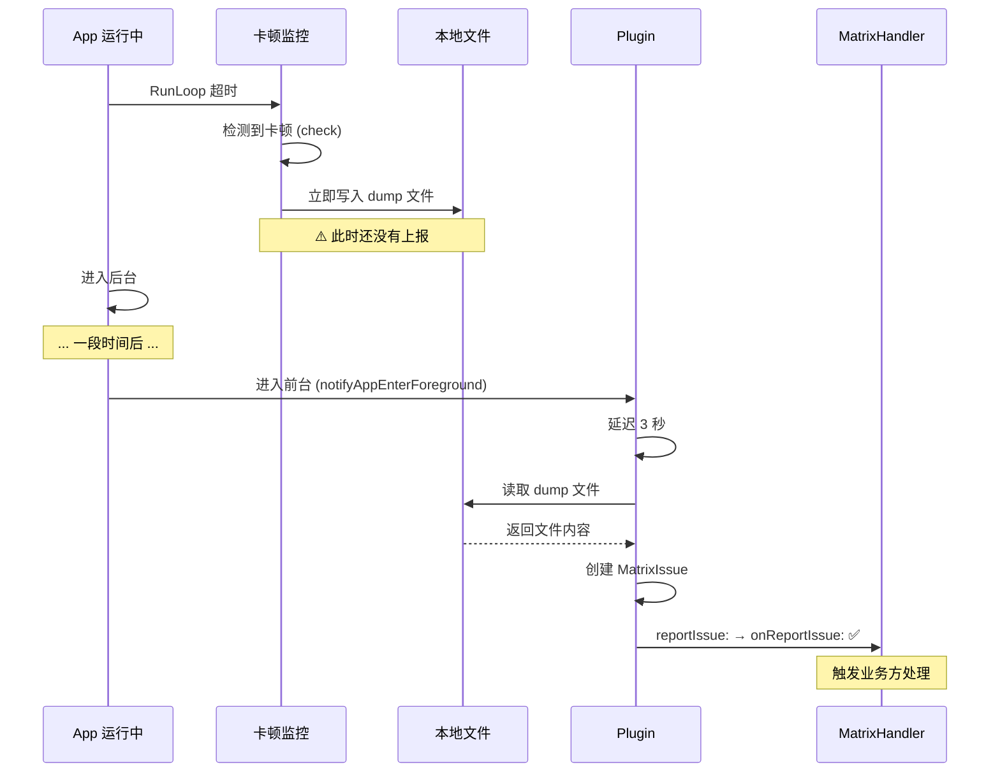
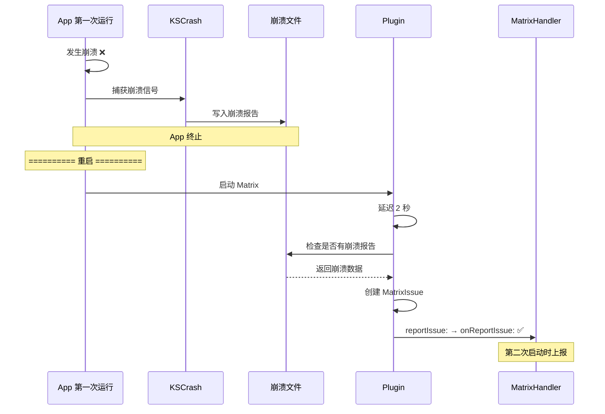
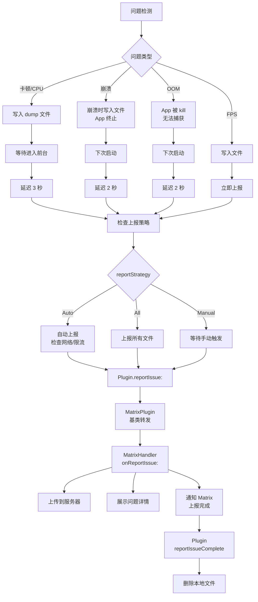

# Matrix 问题上报时机说明

## 核心问题

**Q: `- (void)onReportIssue:(MatrixIssue *)issue` 这个上报是实时的么？还是第二次启动时候上报？**

**A: 根据问题类型不同，上报时机也不同！** ⭐

---

## 📊 问题类型与上报时机对比

| 问题类型 | 检测时机 | 文件写入时机 | 上报时机 | 延迟 |
|---------|---------|------------|---------|------|
| **卡顿（Lag）** | 实时检测 | 检测到后立即写入 | 延迟上报 | **3秒** |
| **崩溃（Crash）** | 崩溃时捕获 | 崩溃时写入 | 下次启动 | **2秒** |
| **OOM** | 无法检测 | 运行时持续记录 | 下次启动 | **2秒** |
| **CPU 耗电** | 实时检测 | 检测到后立即写入 | 延迟上报 | **3秒** |
| **FPS 卡顿** | 实时检测 | 检测到后立即写入 | 延迟上报 | **主线程** |

---

## 1️⃣ 卡顿监控（实时检测 + 延迟上报）

### 1.1 检测流程

```objc
// 文件：WCBlockMonitorMgr.mm

- (EDumpType)check {
    // 1. 检测到主线程卡顿
    if (diff > g_RunLoopTimeOut) {
        m_blockDiffTime = diff;  // 记录卡顿时长
        
        // 2. 立即写入 dump 文件
        NSString *dumpFileName = [self dumpFileWithType:EDumpType_MainThreadBlock];
        
        // 此时 ⚠️ 还没有上报，只是写入了本地文件
        return EDumpType_MainThreadBlock;
    }
}
```

**关键步骤：**
```
检测到卡顿 → 立即 dump 堆栈到文件 → 文件保存到本地 → 等待上报时机
```

### 1.2 上报时机

```objc
// 文件：WCCrashBlockMonitorPlugin.mm

- (void)notifyAppEnterForeground {
    // App 进入前台后延迟 3 秒上报
    dispatch_after(dispatch_time(DISPATCH_TIME_NOW, (int64_t)(3 * NSEC_PER_SEC)), 
                   dispatch_get_main_queue(), ^{
        switch (self.pluginConfig.reportStrategy) {
            case EWCCrashBlockReportStrategy_Auto:
                [self autoReportLag];  // ✅ 自动上报卡顿
                break;
            case EWCCrashBlockReportStrategy_All:
                [self reportAllLagFile];  // 上报所有
                break;
            case EWCCrashBlockReportStrategy_Manual:
                // 手动上报，不自动触发
                break;
        }
    });
}
```

**上报策略：**
1. **`Auto`**: App 进入前台后 3 秒自动上报（默认）
2. **`All`**: App 进入前台后 3 秒上报所有文件
3. **`Manual`**: 业务方手动调用 `reportOneTypeLag:` 或 `reportAllLagFile`

### 1.3 实际上报

```objc
- (void)autoReportLag {
    dispatch_async(self.pluginReportQueue, ^{
        // 检查上报条件
        if ([self.reportDelegate isReportLagLimit:self]) {
            return;  // 上报次数限制
        }
        if ([self.reportDelegate isCanAutoReportLag:self] == NO) {
            return;  // 不允许自动上报
        }
        if ([self.reportDelegate isNetworkAllowAutoReportLag:self] == NO) {
            return;  // 网络不允许（如非 WiFi）
        }
        
        // ✅ 满足条件，开始上报
        [self reportTodayOneTypeLag];
    });
}

- (void)reportTodayOneTypeLag {
    // 1. 读取本地 dump 文件
    NSArray *reportDataArray = [WCDumpReportDataProvider getTodayOneReportDataWithLimitType:...];
    
    // 2. 创建 MatrixIssue
    for (WCDumpReportTaskData *taskData in reportDataArray) {
        NSArray *matrixIssueArray = [self getMatrixIssueFromReportTaskData:taskData 
                                                            withReportType:EMCrashBlockReportType_Lag 
                                                               quickUpload:NO];
        
        // 3. 逐个上报
        for (MatrixIssue *issue in matrixIssueArray) {
            dispatch_async(dispatch_get_main_queue(), ^{
                [self reportIssue:issue];  // ✅ 调用 onReportIssue:
            });
        }
    }
}
```

**时序图：**



---

## 2️⃣ 崩溃监控（崩溃时写入 + 下次启动上报）

### 2.1 崩溃捕获

```objc
// KSCrash 在崩溃时自动写入文件
// 崩溃后 App 已经终止，无法实时上报
```

### 2.2 下次启动检查

```objc
// 文件：WCCrashBlockMonitorPlugin.mm

- (void)start {
    // ... Matrix 启动逻辑 ...
    
    // 延迟 2 秒检查是否有崩溃报告
    [self delayReportCrash];
}

- (void)delayReportCrash {
    dispatch_after(dispatch_time(DISPATCH_TIME_NOW, (int64_t)(2 * NSEC_PER_SEC)), 
                   dispatch_get_main_queue(), ^{
        switch (self.pluginConfig.reportStrategy) {
            case EWCCrashBlockReportStrategy_Auto:
                [self autoReportCrash];  // ✅ 自动上报崩溃
                break;
            // ...
        }
    });
}

- (void)reportCrash {
    dispatch_async(self.pluginReportQueue, ^{
        if ([WCCrashBlockFileHandler hasCrashReport]) {
            // 读取崩溃报告
            NSDictionary *crashDataDic = [WCCrashBlockFileHandler getPendingCrashReportInfo];
            
            // 创建 MatrixIssue
            MatrixIssue *issue = [[MatrixIssue alloc] init];
            issue.reportType = EMCrashBlockReportType_Crash;
            issue.issueData = crashDataDic[@"crashData"];
            
            // 上报
            dispatch_async(dispatch_get_main_queue(), ^{
                [self reportIssue:issue];  // ✅ 调用 onReportIssue:
            });
        }
    });
}
```

**时序图：**



---

## 3️⃣ OOM 监控（持续记录 + 下次启动上报）

### 3.1 运行时记录

```objc
// 文件：WCMemoryStatPlugin.mm

- (void)start {
    // 启动内存监控，持续记录内存分配信息到文件
    memory_logging_start(...);
}
```

### 3.2 下次启动检查

```objc
- (void)deplayTryReportOOMInfo {
    dispatch_after(dispatch_time(DISPATCH_TIME_NOW, (int64_t)(2 * NSEC_PER_SEC)), 
                   dispatch_get_global_queue(DISPATCH_QUEUE_PRIORITY_DEFAULT, 0), ^{
        
        // 检查上次退出是否是 FOOM
        if ([MatrixAppRebootAnalyzer lastRebootType] == MatrixAppRebootTypeAppForegroundOOM) {
            // 获取上次运行的内存记录
            MemoryRecordInfo *lastInfo = [self recordOfLastRun];
            
            // 生成 OOM 报告
            NSData *reportData = [lastInfo generateReportDataWithCustomInfo:customInfo];
            
            // 创建 MatrixIssue
            MatrixIssue *issue = [[MatrixIssue alloc] init];
            issue.issueData = reportData;
            
            // 回到主线程上报
            dispatch_async(dispatch_get_main_queue(), ^{
                [self reportIssue:issue];  // ✅ 调用 onReportIssue:
            });
        }
    });
}
```

**特点：**
- ⚠️ OOM 发生时 App 被系统直接 kill，无法捕获
- ✅ 只能通过下次启动时检查退出类型（FOOM）来判断
- ✅ 读取上次运行时持续记录的内存快照

---

## 4️⃣ CPU 耗电监控（实时检测 + 延迟上报）

### 4.1 检测流程

```objc
// 文件：WCBlockMonitorMgr.mm

- (EDumpType)check {
    // 获取 CPU 使用率
    float appCpuUsage = [m_powerConsumeStackCollector getCPUUsageAndPowerConsumeStack];
    
    // 检测平均 CPU 使用率
    if ([m_cpuHandler cultivateCpuUsage:appCpuUsage periodTime:checkPeriod]) {
        // CPU 超出平均使用率，生成结论报告
        if (m_powerConsumeStackCollector) {
            [m_powerConsumeStackCollector makeConclusion];
        }
        
        return EDumpType_CPUInterval;  // 返回耗电类型
    }
}
```

### 4.2 上报方式

**与卡顿监控相同：** 先写入文件，App 进入前台后延迟 3 秒上报

---

## 5️⃣ FPS 卡顿监控（实时检测 + 实时上报）

### 5.1 检测与上报

```objc
// 文件：WCFPSMonitorPlugin.mm

- (void)uploadReport:(WCFPSRecorder *)recorder {
    // 创建 MatrixIssue
    MatrixIssue *issue = [[MatrixIssue alloc] init];
    issue.issueID = recorder.reportID;
    issue.filePath = recorder.reportPath;
    issue.reportType = EMCrashBlockReportType_Lag;
    
    // 回到主线程立即上报（无延迟）
    dispatch_async(dispatch_get_main_queue(), ^{
        [self reportIssue:issue];  // ✅ 立即调用 onReportIssue:
    });
}
```

**特点：**
- ✅ FPS 监控可以在主线程直接上报
- ✅ 无需等待进入前台，检测到后立即上报

---

## 6️⃣ 上报流程完整链路



---

## 7️⃣ 关键代码位置

### 7.1 上报入口

**文件：** `MatrixPlugin.mm`

```objc
- (void)reportIssue:(MatrixIssue *)issue {
    if (_pluginListener != nil) {
        [_pluginListener onReportIssue:issue];  // ✅ 调用业务方监听器
    }
}
```

### 7.2 业务方处理

**文件：** `MatrixHandler.mm`

```objc
- (void)onReportIssue:(MatrixIssue *)issue {
    // 第一步：保存到本地
    // 第二步：上传到服务器
    [self uploadReportToServer:issue];
    
    // 第三步：展示问题详情
    // ...
    
    // 第四步：通知 Matrix 上报完成
    [[Matrix sharedInstance] reportIssueComplete:issue success:YES];
}
```

### 7.3 上报完成处理

**文件：** `Matrix.mm`

```objc
- (void)reportIssueComplete:(MatrixIssue *)matrixIssue success:(BOOL)bSuccess {
    MatrixInfo(@"问题上报完成: %@, 成功: %d", matrixIssue, bSuccess);
    
    // 通知对应 Plugin
    MatrixPlugin *plugin = [self getPluginWithTag:matrixIssue.issueTag];
    [plugin reportIssueCompleteWithIssue:matrixIssue success:bSuccess];
}
```

**文件：** `WCCrashBlockMonitorPlugin.mm`

```objc
- (void)reportIssueCompleteWithIssue:(MatrixIssue *)issue success:(BOOL)bSuccess {
    if (bSuccess) {
        // ✅ 上报成功，删除本地文件
        if (issue.reportType == EMCrashBlockReportType_Crash) {
            [self removeCrashFromUploadingArray:issue.issueID];
        } else if (issue.reportType == EMCrashBlockReportType_Lag) {
            [self removeLagFromUploadingArray:issue.issueID];
        }
    } else {
        // ❌ 上报失败，保留文件，等待下次上报
        MatrixInfo(@"report issue failed: %@", issue);
    }
}
```

---

## 8️⃣ 总结

### 核心结论

| 维度 | 卡顿/CPU | 崩溃 | OOM | FPS |
|------|---------|------|-----|-----|
| **检测时机** | ✅ 实时 | ✅ 崩溃时 | ❌ 无法检测 | ✅ 实时 |
| **文件写入** | ✅ 立即 | ✅ 崩溃时 | ✅ 持续记录 | ✅ 立即 |
| **上报时机** | ⏰ 延迟 3秒 | 🔄 下次启动 | 🔄 下次启动 | ✅ 立即 |
| **上报条件** | 进入前台 | 重启后 | 重启后 | 检测到后 |

### 关键点

1. **并非所有问题都是实时上报！**
   - 卡顿/CPU：先写文件，延迟上报
   - 崩溃/OOM：下次启动才能上报
   - FPS：可实时上报

2. **延迟上报的原因：**
   - 避免阻塞主线程（dump 文件较大）
   - 检查网络状况（WiFi 优先）
   - 限流控制（避免过度上报）

3. **`onReportIssue:` 调用时机：**
   - 卡顿/CPU：App 进入前台后 3 秒
   - 崩溃/OOM：App 重启后 2 秒
   - FPS：检测到后立即

4. **文件管理：**
   - 检测到问题后立即写入本地文件
   - 上报成功后删除文件
   - 上报失败保留文件，等待下次上报

---

**文档版本：** v1.0  
**创建日期：** 2026-01-06  
**关键词：** Matrix、问题上报、延迟上报、实时上报、卡顿监控、崩溃监控
