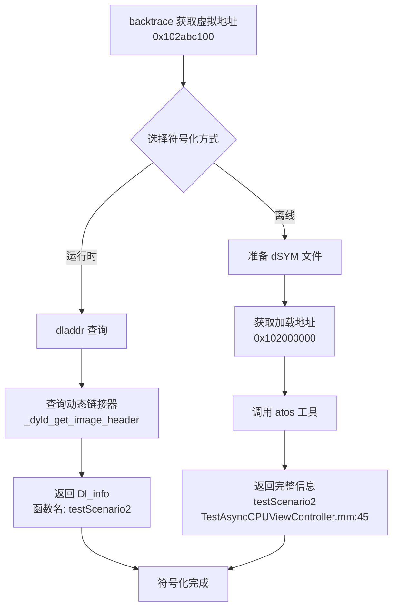

# 虚拟内存地址与符号化原理

## 📋 核心问题

**Q: `backtrace()` 捕获的虚拟内存地址可以通过符号表解析吗？**

**A: 可以！** 有两种符号化方式：
1. **运行时符号化**：使用 `dladdr()` 查询已加载的符号表
2. **离线符号化**：使用 `atos` 工具 + dSYM 文件

---

## 1️⃣ 虚拟内存地址的本质

### 1.1 什么是虚拟内存地址？

```c
// backtrace() 返回的地址
uintptr_t addresses[] = {
    0x0000000102abc100,  // ← 虚拟内存地址（Virtual Memory Address）
    0x0000000102abd200,
    0x00000001febcd300,
    // ...
};
```

**虚拟内存地址 = 相对偏移 + ASLR 随机基址**

```
┌────────────────────────────────────────────────────┐
│  编译时地址（固定）                                 │
├────────────────────────────────────────────────────┤
│  0x100000000  ← Mach-O 文件中的基础地址（固定）     │
│  0x100001abc  ← 函数在文件中的偏移                  │
└────────────────────────────────────────────────────┘
                    ↓ 运行时 + ASLR
┌────────────────────────────────────────────────────┐
│  运行时地址（动态）                                 │
├────────────────────────────────────────────────────┤
│  0x102000000  ← ASLR 随机滑动后的基址               │
│  0x102001abc  ← 实际运行时地址（backtrace 返回）    │
│                   = 0x102000000 + 0x1abc           │
└────────────────────────────────────────────────────┘
```

### 1.2 ASLR（地址空间布局随机化）

**目的：** 防止内存攻击

```objc
// 每次启动应用，库的加载地址都不同
启动 1:  Foundation.framework  加载地址: 0x1a3000000
启动 2:  Foundation.framework  加载地址: 0x1c5000000  // ✅ 随机变化
启动 3:  Foundation.framework  加载地址: 0x198000000
```

---

## 2️⃣ 符号化方式一：运行时符号化 (dladdr)

### 2.1 原理

**运行时动态库信息在内存中可查询！**

```c
#include <dlfcn.h>

uintptr_t address = 0x102abc100;  // backtrace 返回的地址

Dl_info info;
if (dladdr((void *)address, &info)) {
    printf("库名称:   %s\n", info.dli_fname);    // /path/to/MatrixTestApp
    printf("库基址:   %p\n", info.dli_fbase);    // 0x102000000
    printf("符号名称: %s\n", info.dli_sname);    // -[ViewController testScenario2]
    printf("符号地址: %p\n", info.dli_saddr);    // 0x102abc100
}
```

### 2.2 Dl_info 结构体

```c
typedef struct dl_info {
    const char *dli_fname;  // 库文件路径 "/var/.../MatrixTestApp.app/MatrixTestApp"
    void       *dli_fbase;  // 库加载基址 (ASLR 后的地址)
    const char *dli_sname;  // 符号名称（函数名/方法名）
    void       *dli_saddr;  // 符号地址（函数入口地址）
} Dl_info;
```

### 2.3 Matrix 中的运行时符号化实现

**文件：** `KSSymbolicator.c`

```c
bool kssymbolicator_symbolicate(KSStackCursor *cursor) {
    Dl_info symbolsBuffer;
    
    // 查询地址对应的符号信息
    if (ksdl_dladdr_use_cache(cursor->stackEntry.address, &symbolsBuffer)) {
        cursor->stackEntry.imageAddress = (uintptr_t)symbolsBuffer.dli_fbase;   // 库基址
        cursor->stackEntry.imageName = symbolsBuffer.dli_fname;                 // 库路径
        cursor->stackEntry.symbolAddress = (uintptr_t)symbolsBuffer.dli_saddr;  // 符号地址
        cursor->stackEntry.symbolName = symbolsBuffer.dli_sname;                // ✅ 符号名称
        return true;
    }
    
    return false;
}
```

**文件：** `WCMatrixModel.mm`

```objc
- (void)symbolicate {
    Dl_info symbolsBuffer;
    
    // 对地址进行符号化
    if (ksdl_dladdr_use_cache(CALL_INSTRUCTION_FROM_RETURN_ADDRESS(self.address), &symbolsBuffer)) {
        m_symbolName = symbolsBuffer.dli_sname;  // ✅ 获取函数名
    }
    
    // 递归符号化子帧
    for (WCAddressFrame *addressFrame in _childAddressFrame) {
        [addressFrame symbolicate];
    }
}
```

### 2.4 运行时符号化的优缺点

| 优点 | 缺点 |
|------|------|
| ✅ 快速（查询内存即可） | ❌ 无法获取源文件路径和行号 |
| ✅ 不需要外部文件 | ❌ 符号可能被 strip 移除（Release 构建） |
| ✅ 适合实时监控 | ❌ C++ 符号是 mangled 名称（难读） |

**示例输出：**
```
运行时符号化结果:
✅ -[TestAsyncCPUViewController testScenario2]  (Objective-C 方法名)
✅ _ZN6MyTest15heavyComputationEv  (C++ mangled 名称)
❌ 无法获取: TestAsyncCPUViewController.mm:123  (需要 dSYM)
```

---

## 3️⃣ 符号化方式二：离线符号化 (atos + dSYM)

### 3.1 原理

**使用 dSYM 文件进行完整符号化**

```
Xcode 编译时生成:
┌─────────────────────────────┐
│ MatrixTestApp.app           │  ← 可执行文件（符号可能被 strip）
└─────────────────────────────┘

┌─────────────────────────────┐
│ MatrixTestApp.app.dSYM      │  ← 调试符号文件（完整符号表）
│  ├── DWARF/MatrixTestApp    │     包含：函数名、源文件路径、行号
└─────────────────────────────┘
```

### 3.2 atos 工具使用

```bash
# 符号化单个地址
atos -arch arm64 \
     -o MatrixTestApp.app/MatrixTestApp \
     -l 0x102000000 \  # 库加载地址（ASLR 基址）
     0x102abc100       # 要符号化的地址

# 输出：
-[TestAsyncCPUViewController testScenario2] (in MatrixTestApp) (TestAsyncCPUViewController.mm:45)
```

**参数说明：**
- `-arch arm64`: CPU 架构（arm64/x86_64）
- `-o`: dSYM 或可执行文件路径
- `-l`: 库加载地址（Load Address，从 binary_images 中获取）
- 最后是要符号化的虚拟内存地址

### 3.3 计算加载地址和偏移

```
虚拟内存地址 = 加载地址 + 偏移

0x102abc100 = 0x102000000 + 0x00abc100
    ↑            ↑              ↑
 运行时地址   ASLR 基址     固定偏移（在 Mach-O 中）
```

**如何获取加载地址？**

```objc
// 方法 1: 遍历加载的镜像
for (uint32_t i = 0; i < _dyld_image_count(); i++) {
    const struct mach_header *header = _dyld_get_image_header(i);
    intptr_t slide = _dyld_get_image_vmaddr_slide(i);
    const char *name = _dyld_get_image_name(i);
    
    printf("库: %s, 加载地址: %p, 滑动: 0x%lx\n", name, header, slide);
}

// 输出：
// 库: /var/.../MatrixTestApp, 加载地址: 0x102000000, 滑动: 0x2000000
```

**方法 2: 从 Matrix 报告的 binary_images 中获取**

```json
{
  "binary_images": [
    {
      "name": "/var/containers/.../MatrixTestApp.app/MatrixTestApp",
      "image_addr": 4328521728,  // ← 转十六进制 = 0x102000000
      "image_size": 16777216,
      "uuid": "12345678-1234-1234-1234-123456789ABC"
    }
  ]
}
```

### 3.4 Matrix 中的离线符号化实现

**Python 脚本：** `symbolicate_matrix_report.py`

```python
def symbolicate_address(binary_path, load_addr, target_addr, arch='arm64'):
    """使用 atos 符号化单个地址"""
    cmd = [
        'atos',
        '-arch', arch,
        '-o', binary_path,                  # dSYM 路径
        '-l', hex(load_addr),               # 加载地址
        hex(target_addr)                    # 虚拟内存地址
    ]
    
    result = subprocess.run(cmd, capture_output=True, text=True, timeout=5)
    
    if result.returncode == 0:
        symbol = result.stdout.strip()
        # 返回类似：
        # -[TestAsyncCPUViewController testScenario2] (in MatrixTestApp) (TestAsyncCPUViewController.mm:45)
        if symbol and symbol != hex(target_addr):
            return symbol
    
    return None
```

**Go 服务：** `matrix-symbolicate-server/symbolicate.go`

```go
func symbolicateAddress(binaryPath string, loadAddr uint64, targetAddr uint64, arch string) string {
    cmd := exec.Command(
        "atos",
        "-arch", arch,
        "-o", binaryPath,
        "-l", fmt.Sprintf("0x%x", loadAddr),
        fmt.Sprintf("0x%x", targetAddr),
    )
    
    var out bytes.Buffer
    cmd.Stdout = &out
    
    if err := cmd.Run(); err != nil {
        return ""
    }
    
    symbol := strings.TrimSpace(out.String())
    
    // 检查是否成功符号化
    if symbol == "" || strings.HasPrefix(symbol, "0x") {
        return ""
    }
    
    return symbol
}
```

### 3.5 离线符号化的优缺点

| 优点 | 缺点 |
|------|------|
| ✅ 提供完整信息（文件名 + 行号） | ❌ 需要 dSYM 文件 |
| ✅ 支持 strip 后的二进制 | ❌ 需要外部工具（atos） |
| ✅ 符号名完整可读 | ❌ 不适合实时符号化 |
| ✅ 支持 C++ demangling | ❌ 必须匹配正确的 dSYM 版本（UUID） |

**示例输出：**
```
离线符号化结果:
✅ -[TestAsyncCPUViewController testScenario2] (in MatrixTestApp) (TestAsyncCPUViewController.mm:45)
✅ MyTest::heavyComputation() (in MatrixTestApp) (MyTest.cpp:123)  // C++ 已 demangle
```

---

## 4️⃣ 完整的符号化流程



---

## 5️⃣ Matrix 中的实际应用

### 5.1 实时监控（运行时符号化）

```objc
// WCPowerConsumeStackCollector.mm
// CPU 采样时实时符号化
- (void)makeConclusion {
    // 1. 获取虚拟地址
    uintptr_t addresses[100];
    int count = kssc_backtraceCurrentThread(thread, addresses, 100);
    
    // 2. 运行时符号化
    for (int i = 0; i < count; i++) {
        Dl_info info;
        if (dladdr((void *)addresses[i], &info)) {
            NSLog(@"地址: 0x%lx -> 函数: %s", addresses[i], info.dli_sname);
        }
    }
}
```

### 5.2 报告分析（离线符号化）

```bash
# 使用 Python 脚本符号化报告
python symbolicate_matrix_report.py \
    --report report.json \
    --dsym MatrixTestApp.app.dSYM \
    --output symbolicated_report.json

# 输出：
# ✅ 符号化成功: 125 个地址
# ✅ 应用代码: 45 帧
# ✅ 系统库: 80 帧
```

### 5.3 异步堆栈追溯中的符号化

```objc
// WCAsyncStackTraceManager.mm
// 1. 捕获虚拟地址
uintptr_t stackBuffer[50];
int count = backtrace((void **)buffer, 50);

// 2. 保存地址供后续符号化
NSArray *originStack = stackToArray(stackBuffer, count);

// 3. 后续可以用 dladdr 或 atos 符号化
for (NSNumber *addr in originStack) {
    Dl_info info;
    if (dladdr((void *)[addr unsignedLongValue], &info)) {
        printf("异步发起者: %s\n", info.dli_sname);
    }
}
```

---

## 6️⃣ 常见问题

### Q1: Release 构建会不会无法符号化？

**A:** 分情况：
- **运行时符号化 (`dladdr`)**: 
  - ❌ 如果开启了 `Strip Debug Symbols`，运行时符号化会失败
  - ✅ 保留符号（设置 `Strip Style = Non-Global Symbols`）可部分符号化
  
- **离线符号化 (`atos` + dSYM)**:
  - ✅ 即使二进制被完全 strip，只要有匹配的 dSYM 文件就能完整符号化

### Q2: 如何验证 dSYM 和二进制是否匹配？

```bash
# 查看二进制的 UUID
dwarfdump --uuid MatrixTestApp.app/MatrixTestApp
# UUID: 12345678-1234-1234-1234-123456789ABC (arm64) MatrixTestApp

# 查看 dSYM 的 UUID
dwarfdump --uuid MatrixTestApp.app.dSYM
# UUID: 12345678-1234-1234-1234-123456789ABC (arm64) MatrixTestApp

# ✅ UUID 必须完全一致！
```

### Q3: C++ 符号为什么是乱码？

```
运行时符号化:
❌ _ZN6MyTest15heavyComputationEv  (mangled)

离线符号化:
✅ MyTest::heavyComputation()  (demangled)
```

**解决方案：**
```bash
# 手动 demangle
c++filt _ZN6MyTest15heavyComputationEv
# 输出: MyTest::heavyComputation()
```

### Q4: 性能开销如何？

| 操作 | 耗时 | 说明 |
|------|------|------|
| `backtrace()` 获取地址 | ~0.1ms | 快速 |
| `dladdr()` 运行时符号化 | ~0.05ms | 查询内存 |
| `atos` 离线符号化 | ~50-100ms | 启动进程 + 解析 dSYM |

**建议：**
- ✅ 实时监控：使用 `backtrace()` + `dladdr()`
- ✅ 报告分析：使用 `atos` + dSYM（批量符号化）

---

## 7️⃣ 总结

### 核心答案

**✅ `backtrace()` 捕获的虚拟内存地址可以通过符号表解析！**

| 方式 | 技术 | 适用场景 | 信息完整度 |
|------|------|----------|-----------|
| **运行时** | `dladdr()` | 实时监控、快速诊断 | ⭐⭐⭐ 函数名 |
| **离线** | `atos` + dSYM | 报告分析、详细定位 | ⭐⭐⭐⭐⭐ 函数名 + 文件 + 行号 |

### 关键技术点

```
虚拟内存地址 (backtrace 返回)
    ↓
ASLR 基址 + 固定偏移
    ↓
查询符号表（运行时或 dSYM）
    ↓
函数名 + 源文件 + 行号
```

### Matrix 实现总结

1. **采集阶段**: `backtrace()` 获取虚拟地址
2. **实时阶段**: `dladdr()` 快速符号化（用于日志）
3. **分析阶段**: `atos` + dSYM 完整符号化（用于报告）

---

**文档版本：** v1.0  
**创建日期：** 2026-01-06  
**关键词：** 虚拟内存地址、符号化、dladdr、atos、dSYM、ASLR


